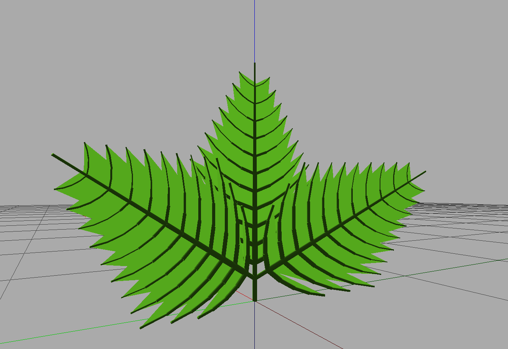

# L-Strawb-Py
L-system based generation of a strawberry plant using Lpy

## Install
The [Lpy](https://github.com/openalea/lpy) framework is required to run this code which supports Windows, OSX and Linux devices.

Once installed simply open the .lpy file into lpy application and run.

## Examples

