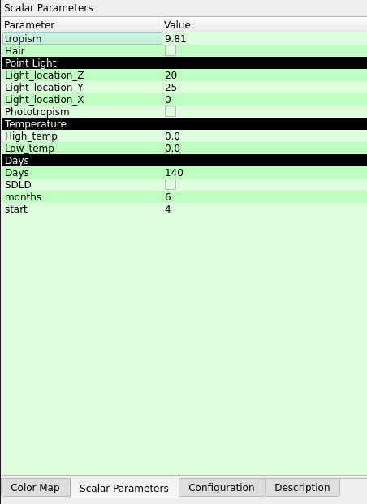
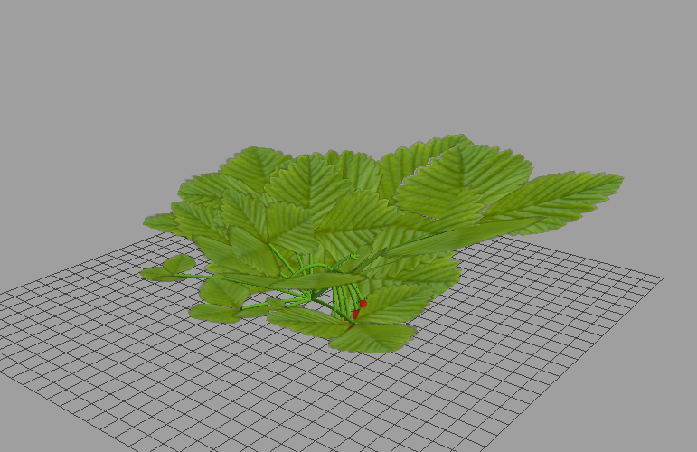

# L-Strawb-Py
L-system based generation of a strawberry plant using Lpy

## Install
The [Lpy](https://github.com/openalea/lpy) framework is required to run this code which supports Windows, OSX and Linux devices.

Install the require libraries
```
pip install -r requirements.txt
```
Once installed simply open the .lpy file into lpy application and run.

# How to use lpy

You can change some of the parameters within Lpy by using the in built `scalar parameters` tab. You can change the gravity strength, start month and end month, hair and point light location.



Data used to calculate growth is read from the `strawberrry_parameters.json` it contains arrrays of the Petiole length, inflorescence and the temperature data. These arrays are based on real sample data and used to generate a random value in the simulation.

## Examples

